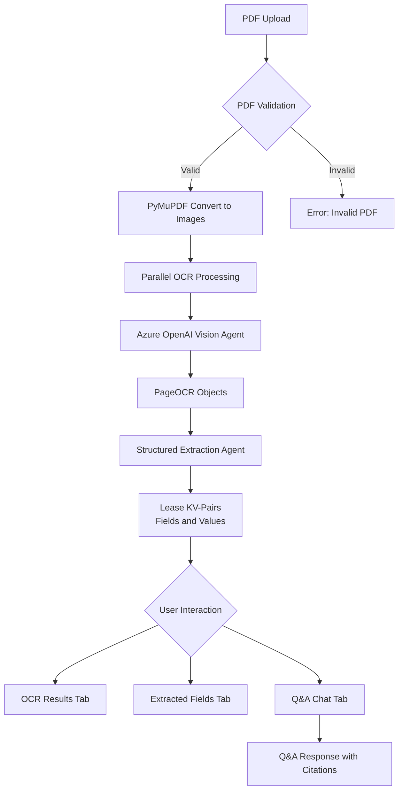
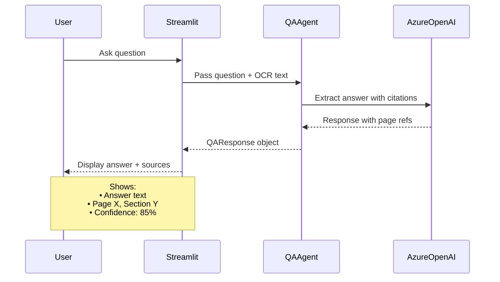

# AI-Powered Lease Chat with Source Citation

AI-powered Streamlit app for **end‑to‑end lease ingestion**, **OCR**, **structured summary extraction**, and **source‑aware Q&A** over a single PDF lease. The system converts PDFs to images, runs **Azure OpenAI** OCR in parallel, extracts a rich **lease key‑value summary**, and lets users **chat with the lease** while always showing **page‑level citations and confidence**.

---

## Overview

**Key objectives**

- **Document ingestion**: Upload a PDF lease (scanned or born‑digital) and validate it.
- **Structured extraction**: Produce a **normalized lease summary** (dozens of fields) suitable for analysts or downstream systems.
- **Source‑aware Q&A**: Let users ask **natural language questions** about the lease with:
  - Page references
  - Section / clause labels (when available)
  - Confidence scores and supporting excerpts
- **No vector-store RAG** (currently): All answers are generated directly from OCR text for the **single uploaded document**.

---

## System Architecture

**High‑level pipeline**

- **Upload PDF → Validate → PyMuPDF pages to images → Parallel OCR → PageOCR objects → Extraction Agent → LeaseKVPairs → Streamlit UI (tabs + chat)**

**Data flow (ingestion + extraction)**



**Q&A interaction flow**



---

## Features

- **Document upload & ingestion**
  - PDF upload via Streamlit sidebar (`.pdf` only).
  - PDF is persisted temporarily and converted to high‑DPI grayscale PNGs using **PyMuPDF** (no Poppler required).

- **Parallel OCR with Azure OpenAI Vision**
  - Each page image is sent to an **Azure OpenAI Vision Agent** (`AzureOpenAI` via `agno`).
  - OCR agent returns a `PageOCR` object with:
    - Full text (printed + handwritten)
    - Tables (Markdown)
    - Handwritten notes
    - Signature descriptions
    - Confidence score \(0–1\)

- **Structured lease summary extraction**
  - All `PageOCR` objects are concatenated as annotated text (`--- PAGE N ---`) and passed to a **structured extraction agent**.
  - Output is a rich **`LeaseKVPairs`** Pydantic model (PARTIES, DATES, OPTIONS, RENT, CAM, TAXES, DEFAULT, SPECIAL COMPLIANCE, etc.).
  - Results are rendered by category and can be **downloaded as JSON**.

- **Contextual Q&A with source citations**
  - Users ask free‑form questions in the **Q&A tab**.
  - A Q&A agent receives the **full OCR text + question** and returns:
    - Answer text
    - `reference_pages: list[int]`
    - `section_reference` string when detectable (e.g. “Section 3.2 – Rent”)
    - `confidence_sapp` (0–1)
    - `relevant_excerpt` supporting the answer
  - Streamlit UI displays:
    - Page list (e.g. “Page 3, 5”)
    - Section/Article label
    - Confidence and qualitative relevance (High/Medium/Low)
    - Expandable **supporting excerpt**

- **Caching for re‑use**
  - OCR + extraction results cached under `.cache/` keyed by **file hash**.
  - Subsequent uploads of the same file **skip OCR/extraction**, loading from cache instantly.
  - Sidebar shows cache count and provides a **“Clear All Cache”** button.

- **Multi‑turn chat**
  - Conversation history kept in `st.session_state`.
  - Each new Q&A exchange is appended and displayed with answer, sources, and excerpts.
  - One‑click **“Clear History”** resets the conversation.

---

## Structured Output Fields

The UI highlights a **friendly subset** but the underlying schema is significantly richer.

**Core conceptual fields (assignment‑friendly view)**

- **Tenant**: `tenant`
- **Landlord**: `landlord`
- **Lease Start / Commencement Date**: `rent_commencement_date`, `tenant_possession_date`, `landlord_delivery_date`, `lease_term_notes`
- **Lease End / Term**: `lease_term_months`, `lease_term_notes`
- **Rent Amount**:
  - `rent_annual_amount`
  - `rent_monthly_amount`
  - `rent_annual_psf`
  - `percentage_rent_details`
- **Renewal Options**:
  - `renewal_number_of_options`
  - `renewal_term_years`
  - `renewal_type`
  - `renewal_earliest_notice`
  - `renewal_latest_notice`
  - `renewal_tenant_initiates`
  - `renewal_notes`
- **Termination Clauses**:
  - `early_termination_description`
  - `early_termination_sales_kickout`
  - `early_termination_cotenancy`
  - Default clauses in `default_*`
- **Security Deposit**: `security_deposit`
- **Special Provisions**:
  - `special_compliance`
  - CAM / TAX / SIGNAGE / USE / SUBLEASE details as separate fields
- **Other key fields**:
  - Address and premises: `address`, `unit`, `leased_area_sf`, `remeasurement_provision`, `guarantor`
  - Insurance, CAM, Taxes, Holdover, Late Fees, Sublease, Options, etc.

For the full schema, see `models/schemas.py` (`LeaseKVPairs`, `PageOCR`, `QAResponse`).

---

## Technology Stack

- **Language & Runtime**
  - Python **3.14+** (tested on Windows 11)
- **Frameworks & Core Libraries**
  - **Streamlit** – web UI and app framework
  - **Pydantic** – data models and validation
  - **Agno AGI** – agent orchestration framework
- **PDF & OCR**
  - **PyMuPDF (`fitz`)** – Convert PDF pages directly to high‑DPI grayscale PNGs
  - **Azure OpenAI via `AzureOpenAI`** – Vision model for OCR + structured `PageOCR` objects
- **LLM / Agents**
  - **Azure OpenAI Chat** deployment (`AZURE_DEPLOYMENT`) for:
    - Lease KV‑pair extraction agent
    - Q&A agent with citations
- **Storage / Caching**
  - Local JSON cache in `.cache/` (no DB required)
- **Dependencies**
  - See `requirements.txt` (includes `agno`, `streamlit`, `PyMuPDF`, `openai`, `pydantic`, `python-dotenv`, etc.)

---

## What Was Coded by Me vs AI-Assisted

- **Coded by Me**
  - **Overall architecture & pipeline design**
    - PDF → PyMuPDF → images → parallel OCR → structured extraction → Q&A.
  - **Streamlit UI & UX**
    - Approach and design prompt
  - **OCR orchestration**
    - `pdf_to_images`, `parallel_ocr`, thread pooling, high‑DPI grayscale optimization.
  - **Data models & schemas**
    - `PageOCR`, `LeaseKVPairs`, `QAResponse` and `KV_FIELD_CATEGORIES`.
  - **Caching layer**
    - Hashing by file content, JSON serialization, metadata, and cache management UI.
  - **Azure configuration & environment handling**
    - `.env` loading, Azure keys/endpoints, model selection, and safe defaults.
  - **Error handling & guardrails**
    - Handling empty OCR results, failed agent calls, and safe fallback responses.


- **AI-Assisted**
  - **Prompt refinement** for:
    - Lease KV‑pair extraction (`extract_kv_pairs_prompt`).
    - Legal Q&A with explicit citations and confidence (`qa_agent_prompt`).
  - **Schema tuning & field naming** to better match real‑world lease review workflows.
  - **Readme refinement** : Updating and phrasing readme file.
  - **Minor debugging and refactoring suggestions** (e.g., safer response handling, edge‑case defaults).
  - **Streamlit UI & UX**
    - Sidebar workflow, tabbed layout (OCR / Extracted Fields / Q&A), conversation history, download/export. 
    - Used Streamlit and Agno AGI docs and ai chatbot assistants.
    - Links: https://docs.agno.com/, https://docs.streamlit.io/, https://chatgpt.com/
---

## Edge Case Analysis

**At least 5 key edge cases and mitigations:**

- **1. Low‑quality scans / tiny text**
  - **Issue**: Blurry scans, faxed copies, or tiny fonts reduce OCR accuracy.
  - **Mitigation**:
    - Use higher DPI (default 400–600) in `pdf_to_images`.
    - Grayscale conversion for better OCR signal.
    - Encourage users in README to re‑upload higher‑quality scans when possible.

- **2. Heavily handwritten, stamped, or redlined pages**
  - **Issue**: Handwriting and stamps are harder to parse and may only partially OCR.
  - **Mitigation**:
    - OCR prompt explicitly separates **handwritten notes** and **signatures** (`PageOCR.handwritten_notes`, `.signatures`).
    - Display handwritten notes and signatures in the OCR tab so reviewers can manually inspect where the model is less confident.

- **3. Multi‑page clauses and cross‑references**
  - **Issue**: Important clauses (e.g., renewal or termination) may span multiple pages or reference other sections.
  - **Mitigation**:
    - Extraction prompt instructs the model to **combine information from all pages** and to **not paraphrase** long clauses.
    - Q&A prompt encourages citing **all relevant pages** and explicitly calls out conflicts.

- **4. Missing or implicit fields**
  - **Issue**: Some leases omit certain fields (e.g., expansion options) or only imply them.
  - **Mitigation**:
    - `LeaseKVPairs` uses **nullable fields**; prompt instructs to **leave missing fields as null** rather than hallucinating.
    - UI only displays fields that are present, reducing noise.

- **5. Non‑lease PDFs or wrong document type**
  - **Issue**: Users might upload the wrong PDF (e.g., marketing brochure, invoice).
  - **Mitigation**:
    - Q&A prompt explicitly restricts answers to provided text and encourages **confidence 0 + “information not present”** when lease concepts are missing.
    - Future improvement: lightweight classifier to reject non‑lease documents.

- **6. Very long leases (dozens/hundreds of pages)**
  - **Issue**: High token usage and slower latency when passing full OCR text on each question.
  - **Mitigation**:
    - Current design is **single‑document, no RAG**, but can be extended to chunking and retrieval.
    - Parallel OCR already reduces upfront cost; caching avoids re‑running OCR.

- **7. Mixed languages**
  - **Issue**: Leases may include clauses in multiple languages.
  - **Mitigation**:
    - Current prompts are English‑centric but Azure models support multilingual text; answers are grounded in whatever text is present.
    - Future improvement: explicit multilingual prompts and language detection.

---

## Assumptions

- **Input document type**
  - Single **PDF lease agreement** (commercial focus, but works for many lease formats).

- **Formatting expectations**
  - Text may be a mix of:
    - Digital text
    - Scanned images
    - Tables
    - Handwritten annotations
  - No requirement for bookmarked or hyperlinked PDFs.

- **Scope**
  - **Single document at a time**:
    - No cross‑document comparison.
    - No corpus‑level RAG; each run is self‑contained.

- **Environment**
  - Runs on **Windows 11** (or similar desktop OS) with **Python 3.14** and network access to Azure OpenAI.

---

## Limitations

- **OCR quality**
  - Dependent on scan quality, DPI, and page cleanliness.
  - Handwriting and signatures are described textually; **no current bounding‑box or region‑level highlighting**.

- **No vector-store RAG**
  - The Q&A agent receives the **entire OCR text** for the current document.
  - There is **no persistent embedding store or vector index** today.
  - On very long leases, this can increase latency and token usage.

- **Section detection**
  - Section/Article references are inferred from text (e.g., “Section 3.2 – Rent”).
  - There is no explicit structural parsing (e.g., outline tree).

- **Confidence calibration**
  - `confidence` and OCR confidence are model‑reported and not calibrated against human labels.

- **Clause cross‑references**
  - Cross‑references are not resolved into a structured graph; they are mentioned in text but not exposed as a formal link structure.

---

## Trade-offs

| **Decision** | **Trade-off** |
| ------------ | ------------- |
| Use **PyMuPDF** for PDF → image | Simple install on Windows (no Poppler) vs. less control than some specialized OCR pipelines. |
| Use **Azure OpenAI Vision + Chat** agents directly (no RAG) | Simpler architecture and stronger end‑to‑end reasoning vs. higher token usage and slower Q&A on very long documents. |
| **Single rich `LeaseKVPairs` schema** | Great for analysis/exports vs. more prompt complexity and risk of partial population on weak documents. |
| **Local JSON cache (`.cache/`)** instead of DB | Easy setup and fast reuse on a single machine vs. no multi‑user / multi‑machine sharing. |
| **Streamlit UI** | Very fast to build and iterate vs. less control than a custom React/Next front‑end. |

---

## How to Run (Windows 11 + Python)

### 1. Prerequisites

- **OS**: Windows 11
- **Python**: 3.12 or later (recommended: 3.14)
- **Azure OpenAI**:
  - Deployed chat model (e.g. `gpt-4o-mini`)
  - Vision‑capable deployment for OCR (via same or separate deployment, configured via `.env`)
- **Git** : To clone the repo 

### 2. Clone the repository

```bash
git clone <your-repo-url>.git
cd lease_extractor
```

### 3. Create and activate a virtual environment (Windows 11, PowerShell)

```bash
python -m venv .venv
.\.venv\Scripts\Activate.ps1
```

If your system uses `py` launcher:

```bash
py -3.11 -m venv .venv
.\.venv\Scripts\Activate.ps1
```

### 4. Install dependencies

```bash
pip install --upgrade pip
pip install -r requirements.txt
```

### 5. Configure environment variables

Create a `.env` file (or copy `.env.example` to `.env`) in the project root:

```env
AZURE_OPENAI_ENDPOINT="https://<your-resource-name>.openai.azure.com/"
AZURE_OPENAI_API_KEY="<your-azure-openai-api-key>"
AZURE_OPENAI_VERSION="2023-09-15-preview"
AZURE_DEPLOYMENT="gpt-4o-mini"  # or your deployment name
```

These are loaded in `utils/config.py` and used by all agents.

### 6. Run the Streamlit app

From the project root:

```bash
streamlit run main.py
```

Then open the URL printed in the console (typically `http://localhost:8501`).

### 7. Usage

1. **Upload** a lease PDF in the sidebar.
2. Configure **parallel workers** and **DPI** (400–600 recommended for OCR).
3. Click **“Process PDF”**:
   - Step 1: Parallel OCR on all pages.
   - Step 2: Structured KV extraction.
   - Step 3: Results cached under `.cache/`.
4. Explore:
   - **OCR Results tab** – Per‑page text, tables, handwritten notes, signatures, confidence.
   - **Extracted Fields tab** – Category‑grouped KV pairs with **download as JSON**.
   - **Q&A tab** – Ask questions, get answers with **page references, sections, confidence, and excerpts**.

---

## Configuration

- **Azure Model Settings** – `utils/config.py`
  - `AZURE_MODEL_ID` ← `AZURE_DEPLOYMENT`
  - `AZURE_OPENAI_API_KEY`
  - `AZURE_OPENAI_ENDPOINT`
  - `AZURE_OPENAI_VERSION`
- **Cache directory**
  - `CACHE_DIR = ".cache"` (created automatically).
- **OCR settings**
  - DPI and worker count configured via Streamlit UI.

---

## Future Improvements

- **Bounding boxes & visual highlighting**
  - Extend `PageOCR` to include **bounding box coordinates (x, y, w, h)** for key text spans, tables, signatures.
  - Use these bounding boxes to **highlight answer regions** on rendered page thumbnails.
  - Link from Q&A answers directly to the **exact region** on the relevant page.

- **More formats**
  - Add ingestion for **image files** (JPEG/PNG/TIFF), **Word documents**, and **scanned bundles**.
  - Unified pipeline that normalizes everything into the `PageOCR` + `LeaseKVPairs` schema.

- **Multilingual support**
  - Enhance prompts for **multilingual OCR and Q&A**.
  - Detect document language and answer in either the source language or English summary, based on user selection.

- **Optional RAG layer (not currently implemented)**
  - Introduce a **vector store** (e.g., pgvector, Chroma, or Azure AI Search) to:
    - Index OCR chunks by embeddings.
    - Retrieve only the most relevant chunks for each question.
  - This would reduce latency and token usage for very long leases while maintaining citations.

- **Document classification & validation**
  - Light classifier to:
    - Confirm file is a **lease agreement** before running full pipeline.
    - Tag lease type (retail/office/industrial) for downstream analysis.

- **Quality & evaluation**
  - Build a **test harness** with annotated leases to evaluate:
    - Field‑level extraction accuracy.
    - Q&A citation correctness and confidence calibration.
